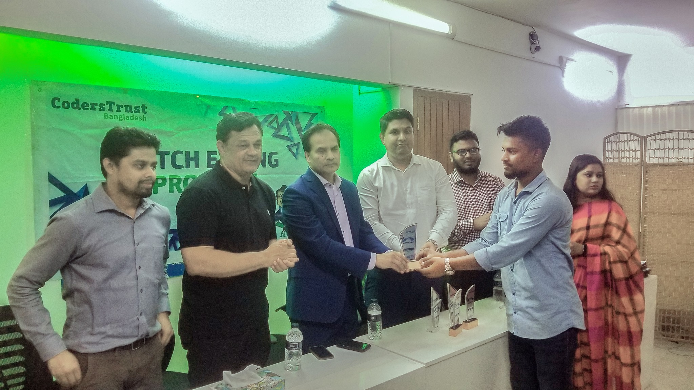

## 🙍 About Me :

I am a passionate web application developer with front-end and full-stack development experience over 4 years. Proficient in ReactJS, NextJS, ExpressJS, Fastify, MySQL, PostgreSQL, and MongoDB. Experienced in DevOps deploying applications on VPS using CI/CD pipelines and well-versed in Linux-based environments. Develop efficient, user-focused web solutions, and scalable web applications, constantly learning new technologies.

## 🛠️ Tools and Technologies :

<table align="center">
  <tr>
    <td align="center" width="96">
         Node.js
    </td>
    <td align="center" width="96">
         JavaScript
    </td>
    <td align="center" width="96">
         TypeScript
    </td>
    <td align="center" width="96">
         Python
    </td>
     <td align="center" width="96">
         PHP
    </td>
    <td align="center" width="96">
         C#
    </td>
  </tr>
  <tr>
      <td align="center" width="96">
         React.js
    </td>
     <td align="center" width="96">
         Next.js
    </td>
    <td align="center" width="96">
         Express.js
    </td>
    <td align="center" width="96">
         Fastify
    </td>
    <td align="center" width="96">
         Nest.js
    </td>
    <td align="center" width="96">
       Django
    </td>

  </tr>
    <tr>
       <td align="center" width="96">
         MongoDB
    </td>
    <td align="center" width="96">
         MySQL
    </td>
    <td align="center" width="96">
       Postgres
    </td>
   <td align="center" width="96">
         Supabase
    </td>
    <td align="center" width="96">
         Firebase
   </td>
   <td align="center" width="96">
         MariaDB
   </td>
  </tr>
  </tr>
    <td align="center" width="96">
         Nginx
    </td>
    <td align="center" width="96">
         Nginx
    </td>
    <td align="center" width="96">
         AWS
    </td>
       <td align="center" width="96">
         Docker
   </td>
    <td align="center" width="96">
       Jenkins
    </td>
   <td align="center" width="96">
         Terraform
    </td>
  </tr>
  <tr>
   <td align="center" width="96">
         Redis
   </td>
   <td align="center" width="96">
         Jest
   </td>
   <td align="center" width="96">
         Kafka
   </td>
   <td align="center" width="96">
         Redux
   </td>
   <td align="center" width="96">
         Css
   </td>
    <td align="center" width="96">
         Tailwind
    </td>
  </tr>
  <tr>
   <td align="center" width="96">
         Wordpress
   </td>
   <td align="center" width="96">
         Postman
   </td>
    <td align="center" width="96">
         Figma
    </td>
    <td align="center" width="96">
         Git
   </td>
   <td align="center" width="96">
         Github
   </td>
   <td align="center" width="96">
         Github Actions
   </td>
  </tr>
</table>

## 🔥 Github stats :

     

